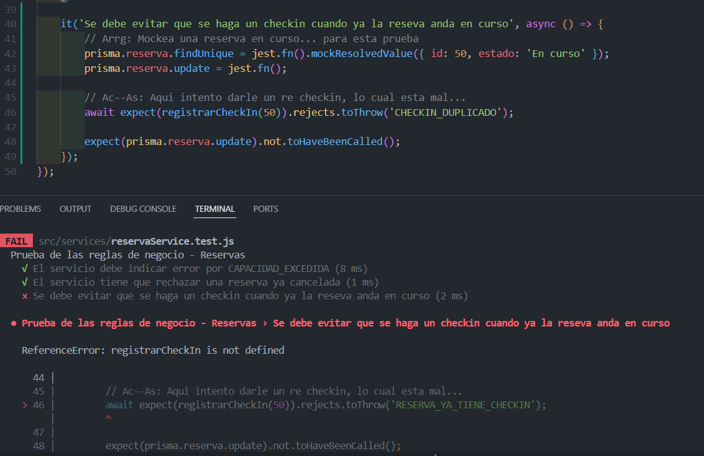
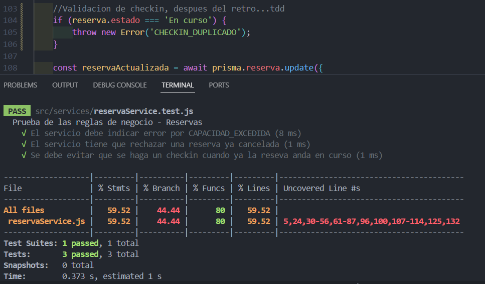
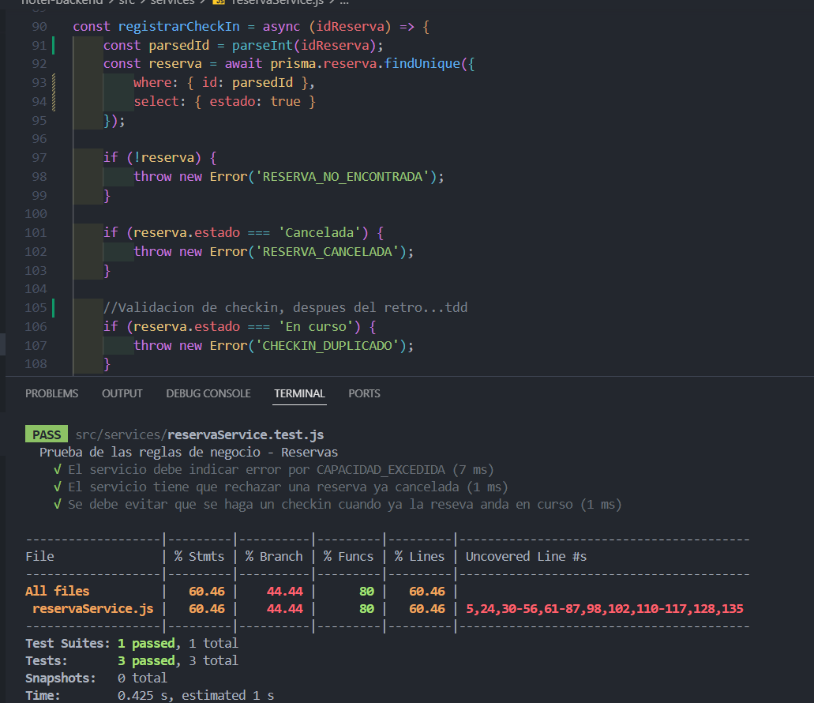
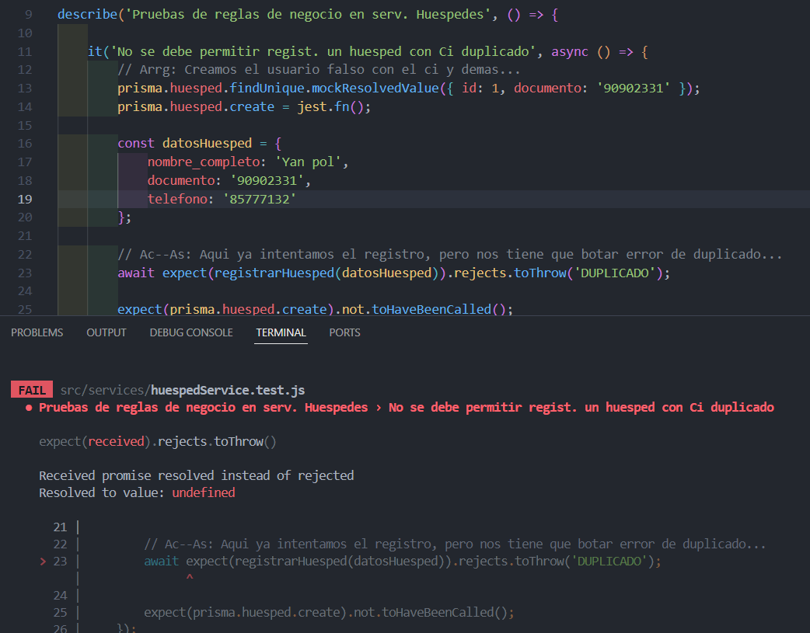
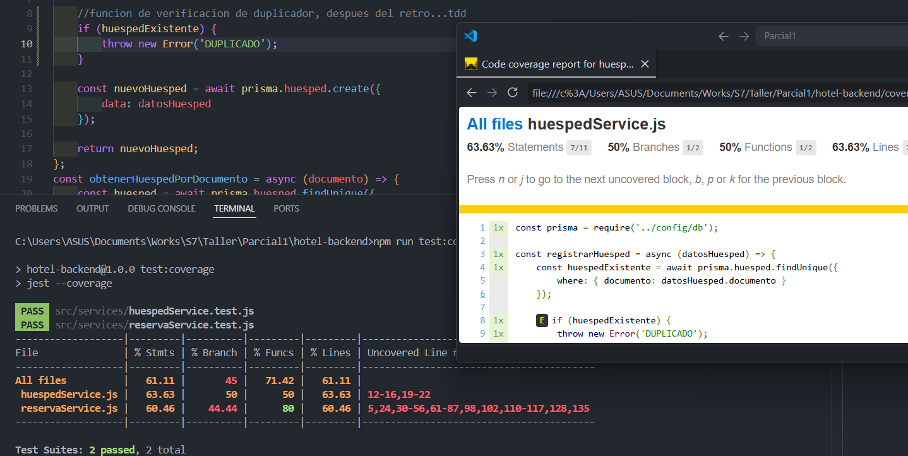
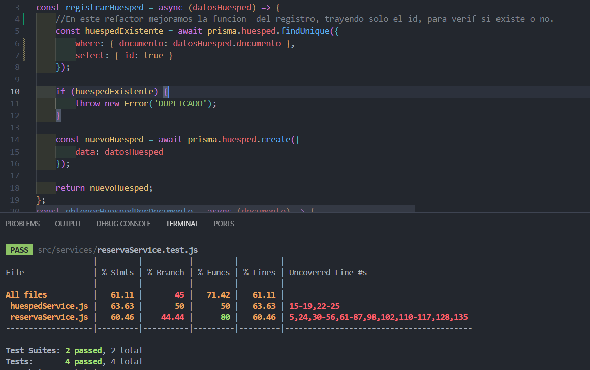
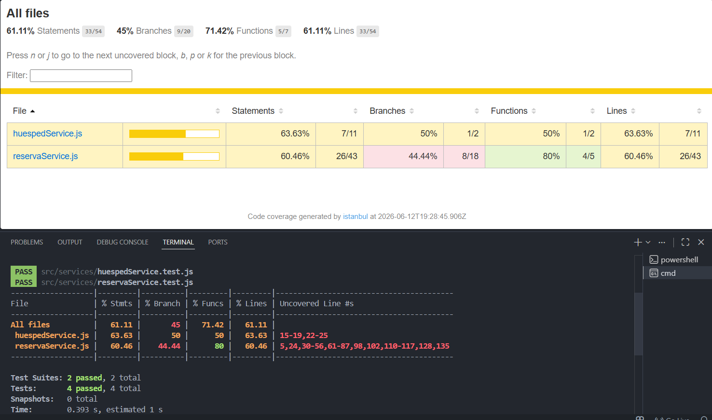

# EF — Reporte de Proyecto
**Estudiante:** [Fernando Sejas Colque]
**Proyecto:** [Hotel Pequeño]
**Repositorio:** [[URL del repositorio](https://github.com/FerSV4/Hoteleria-Taller)]
**Fecha de entrega:** [12/06/2026]

---

## Sección 1 — Deploy

**URL del proyecto:** [[URL pública](https://hotelerias.netlify.app/)]
**Swagger / API:** [[URL](https://hoteleria-taller-production.up.railway.app/api-docs/)]

> Captura del proyecto corriendo con datos reales:


---

## Sección 2 — Pruebas con TDD + cobertura

### Cobertura inicial (0%)

**Herramienta:** [Jest]

> Captura del reporte de cobertura antes de escribir pruebas nuevas:


> Cobertura de pruebas despues del ec2
---

### Ciclo TDD — Prueba 1

**HU:** [HU-05] [Gestión de Reservas]
> Como recepcionista quiero cancelar una reserva existente para que la habitacione ste libre, pero el sistema debe impedir cancelar una reserva que ya fue cancelada.

**CA elegido:** [El sistema debe rechazar la cancelacion y arrojar un error cuando se intenta cancelar una reserva en estado 'Cancelada'.]

**Commit 1 — Rojo** [`36a7106`](https://github.com/FerSV4/Hoteleria-Taller/commit/36a7106d6dc3526eae0813790b35ffda65d04004):
```
test: [HU-05] agregacion de la prueba Rechazo a reserva cancelada.
```
Test escrito (sin el código que lo pase aún):
```csharp / typescript
 it('El servicio tiene que rechazar una reserva ya cancelada', async () => {
        // Arrg: aqui simulo que la reserva esta cancelada...
        prisma.reserva.findUnique = jest.fn().mockResolvedValue({ id: 99, estado: 'Cancelada' });
        prisma.reserva.update = jest.fn();

        // Ac-As: Se reintenta cancelar cuando ya esta cancelada..
        await expect(cancelarReserva(99)).rejects.toThrow('RESERVA_YA_CANCELADA');
        expect(prisma.reserva.update).not.toHaveBeenCalled();
    });
```

> Captura del test fallando o error de compilación:


---

**Commit 2 — Verde** [`f6ad6df`](https://github.com/FerSV4/Hoteleria-Taller/commit/f6ad6df43b8c3b446d4a76dfe75f352e15975c8f):
```
feat: [HU-05] Validacion al cancelar reserva, verif.
```
Código mínimo para hacer pasar el test:
```csharp / typescript
const reserva = await prisma.reserva.findUnique({
        where: { id: idReserva }
    });

    if (reserva && reserva.estado === 'Cancelada') {
        throw new Error('RESERVA_YA_CANCELADA');
    }
```

> Captura del test pasando:


---

**Commit 3 — Refactor** [`eda38fb`](https://github.com/FerSV4/Hoteleria-Taller/commit/eda38fbc38ff151501f2433ceef8542a446a4cbc):
```
refactor: [HU-05] modificacion de funcion y se optimiza
```
Cambios aplicados:
```csharp / typescript
const cancelarReserva = async (idReserva) => {
    //refactor en este caso es verificar el estado antes de intentar actualizarla.
    const reserva = await prisma.reserva.findUnique({
        where: { id: idReserva },
        select: { estado: true }
    });

    if (!reserva) {
        throw new Error('RESERVA_NO_EXISTE');
    }

    if (reserva.estado === 'Cancelada') {
        throw new Error('RESERVA_YA_CANCELADA');
    }
    
    return await prisma.reserva.update({
        where: { id: idReserva },
        data: { estado: 'Cancelada' }
    });
```

> Captura del test aún pasando después del refactor:


---

### Ciclo TDD — Prueba 2

**HU:** [HU-04] [Registrar check in]
> Como recepcionista quiero registrar el check in de una reserva existente para marcar el ingreso del huesped al hotel.

**CA elegido:** [Dado que una reserva ya realizo check in, cuando el usuario intente registrarlo de nuevo, entonces el sistema debe evitar que se rehaga la accion.]

**Commit 1 — Rojo** [`7a1bf6e`](https://github.com/FerSV4/Hoteleria-Taller/commit/7a1bf6e0c0a8a996ed2177b0b69058acf2c031ea):
```
test: [HU-04] agregar prueba que evita el doble checkin.

```
Test escrito (sin el código que lo pase aún):
```csharp / typescript
it('Se debe evitar que se haga un checkin cuando ya la reseva anda en curso', async () => {
        // Arrg: Mockea una reserva en curso... para esta prueba
        prisma.reserva.findUnique = jest.fn().mockResolvedValue({ id: 50, estado: 'En curso' });
        prisma.reserva.update = jest.fn();

        // Ac--As: Aqui intento darle un re checkin, lo cual esta mal...
        await expect(registrarCheckIn(50)).rejects.toThrow('RESERVA_YA_TIENE_CHECKIN');
        
        expect(prisma.reserva.update).not.toHaveBeenCalled();
    });
```
> Captura del test fallando o error de compilación:



---

**Commit 2 — Verde** [`a1be3cc`](https://github.com/FerSV4/Hoteleria-Taller/commit/a1be3ccd55906d298cea8dafae50735c9b11abd5):
```
feat: [HU-04] Validacion de no re checkin - retro

```
Código mínimo para hacer pasar el test:
```csharp / typescript
const registrarCheckIn = async (idReserva) => {
    const reserva = await prisma.reserva.findUnique({
        where: { id: parseInt(idReserva) }
    });

        if (reserva.estado === 'En curso') {
        throw new Error('CHECKIN_DUPLICADO');
    }
```

> Captura del test pasando:



---

**Commit 3 — Refactor** [`d8c4ea5`](https://github.com/FerSV4/Hoteleria-Taller/commit/d8c4ea596b888df8ab57f55c0be22a25db6579f6):
```
refactor: [HU-04] mejora de la funcion, menor redundacia del parse y se aclara el estado desde la db
```
Cambios aplicados:
```csharp / typescript
const registrarCheckIn = async (idReserva) => {
    const parsedId = parseInt(idReserva);
    const reserva = await prisma.reserva.findUnique({
        where: { id: parsedId },
        select: { estado: true }
    });

    if (!reserva) {
        throw new Error('RESERVA_NO_ENCONTRADA');
    }

    if (reserva.estado === 'Cancelada') {
        throw new Error('RESERVA_CANCELADA');
    }

    //Validacion de checkin, despues del retro...tdd
    if (reserva.estado === 'En curso') {
        throw new Error('CHECKIN_DUPLICADO');
    }

    const reservaActualizada = await prisma.reserva.update({
        where: { id: parsedId },
        data: {
            estado: 'En curso'
        }
    });

    return reservaActualizada;
};
```

> Captura del test aún pasando después del refactor:


---

### Ciclo TDD — Prueba 3

**HU:** [HU-01] [Registrar huésped]
> Como recepcionista quiero registrar los datos básicos de un huésped para poder usar su información al momento de realizar reservas.

**CA elegido:** [Dado que ya existe un huésped con el mismo documento de identidad, cuando se intente registrar nuevamente, entonces el sistema debe impedir el duplicado.]

**Commit 1 — Rojo** [`6ae2c3c`](https://github.com/FerSV4/Hoteleria-Taller/commit/6ae2c3c7c22ee6ee8de23de8ba5ba76291f51a4e):
```
test: [HU-01] agregar prueba, evitar huespedes duaplicados
```
Test escrito (sin el código que lo pase aún):
```csharp / typescript
describe('Pruebas de reglas de negocio en serv. Huespedes', () => {
    
    it('No se debe permitir regist. un huesped con Ci duplicado', async () => {
        // Arrg: Creamos el usuario falso con el ci y demas...
        prisma.huesped.findUnique.mockResolvedValue({ id: 1, documento: '90902331' });
        prisma.huesped.create = jest.fn();

        const datosHuesped = {
            nombre_completo: 'Yan pol',
            documento: '90902331',
            telefono: '85777132'
        };

        // Ac--As: Aqui ya intentamos el registro, pero nos tiene que botar error de duplicado...
        await expect(registrarHuesped(datosHuesped)).rejects.toThrow('DUPLICADO');
        
        expect(prisma.huesped.create).not.toHaveBeenCalled();
    });
```

> Captura del test fallando o error de compilación:



---

**Commit 2 — Verde** [`b0c8ab6`](https://github.com/FerSV4/Hoteleria-Taller/commit/b0c8ab687a683bf33a39cf8e8649a54f20778d94):
```
feat: [HU-01] se activa la verif. del duplicado, prueba correcta
```
Código mínimo para hacer pasar el test:
```csharp / typescript
const registrarHuesped = async (datosHuesped) => {
    const huespedExistente = await prisma.huesped.findUnique({
        where: { documento: datosHuesped.documento }
    });

        if (huespedExistente) {
        throw new Error('DUPLICADO');
    }
        const nuevoHuesped = await prisma.huesped.create({
        data: datosHuesped
    });

    return nuevoHuesped;
};
```

> Captura del test pasando:



---

**Commit 3 — Refactor** [`c098e78`](https://github.com/FerSV4/Hoteleria-Taller/commit/c098e785ad425593cf146d4dadc5a43a6b7b639a):
```
refactor: [HU-01] mejora de la sentencia de supa y la funcion mas eficiente

```
Cambios aplicados:
```csharp / typescript
const registrarHuesped = async (datosHuesped) => {
    //En este refactor mejoramos la funcion  del registro, trayendo solo el id, para verif si existe o no.
    const huespedExistente = await prisma.huesped.findUnique({
        where: { documento: datosHuesped.documento },
        select: { id: true }
    });

    if (huespedExistente) {
        throw new Error('DUPLICADO');
    }

```

> Captura del test aún pasando después del refactor:


---

### Cobertura final

**Cobertura alcanzada:** 61.11%

> Captura del reporte de cobertura final:



> Si la cobertura es <50%, pegar aquí la justificación enviada al docente:

---

## Sección 3 — Code smells corregidos

Mínimo 3 nuevos (adicionales a los del EC2).

| # | Tipo | Commit | Descripción |
|---|---|---|---|
| 1 | [Magic Strings] | [`b1b4d29`](https://github.com/FerSV4/Hoteleria-Taller/commit/b1b4d29881ccc5f135e76f32f388a51c6899d916) | [Antes las sentencias de los estados eran muy redundantes en varias partes del codigo, ahora estan en un enum y llamadas de forma correcta donde se la necesita ] |
| 2 | [Tipo] | [`b2c3d4e`](https://github.com/usuario/repo/commit/b2c3d4e) | [Antes: X → Después: Y] |
| 3 | [Tipo] | [`c3d4e5f`](https://github.com/usuario/repo/commit/c3d4e5f) | [Antes: X → Después: Y] |

### Detalle — Smell 1: [Magic Strings]

**Código antes:**
```csharp / typescript
const prisma = require('../config/db');


const validarReglaFechaCapacidad = (ingreso, salida, cantidadPersonas, capacidadHabitacion) => {
    if (salida <= ingreso) {
        throw new Error('FECHAS_INVALIDAS');
    }
    if (cantidadPersonas > capacidadHabitacion) {
        throw new Error('CAPACIDAD_EXCEDIDA');
    }
};

```

**Código después:**
```csharp / typescript
const prisma = require('../config/db');

const ESTADOS_RESERVA = {
    RESERVADA: 'Reservada',
    EN_CURSO: 'En curso',
    CANCELADA: 'Cancelada'
};

    if (!reserva) {
        throw new Error('RESERVA_NO_ENCONTRADA');
    }

    if (reserva.estado === ESTADOS_RESERVA.CANCELADA) {
        throw new Error('RESERVA_CANCELADA');
    }

    //Validacion de checkin, despues del retro...tdd
    if (reserva.estado === ESTADOS_RESERVA.EN_CURSO) {
        throw new Error('CHECKIN_DUPLICADO');
    }
```

---

### Detalle — Smell 2: [Tipo]

> Mismo formato.

---

### Detalle — Smell 3: [Tipo]

> Mismo formato.

---

## Sección 4 — Trazabilidad HU → CA → test

| # | Historia de Usuario | Criterio de Aceptación | Prueba que valida ese CA | Commit |
|---|---|---|---|---|
| 1 | [HU título] | [Dado/Cuando/Entonces] | [NombrePrueba_Escenario_Resultado] | [`a1b2c3d`](https://github.com/usuario/repo/commit/a1b2c3d) |
| 2 | [HU título] | [Dado/Cuando/Entonces] | [NombrePrueba_Escenario_Resultado] | [`b2c3d4e`](https://github.com/usuario/repo/commit/b2c3d4e) |
| 3 | [HU título] | [Dado/Cuando/Entonces] | [NombrePrueba_Escenario_Resultado] | [`c3d4e5f`](https://github.com/usuario/repo/commit/c3d4e5f) |

### Cadena 1 — [Nombre HU]

**Historia de Usuario:**
> Como [rol] quiero [acción] para [beneficio]

**Criterio de Aceptación elegido:**
> Dado [contexto] / Cuando [acción] / Entonces [resultado esperado]

**Prueba que valida este CA:**
```csharp / typescript
[Fact / test]
public void Metodo_Escenario_ResultadoEsperado()
{
    // Arrange — setup del contexto del CA
    // Act — ejecutar la acción del CA
    // Assert — verificar el resultado del CA
}
```

---

### Cadena 2 — [Nombre HU]

> Mismo formato.

---

### Cadena 3 — [Nombre HU]

> Mismo formato.
