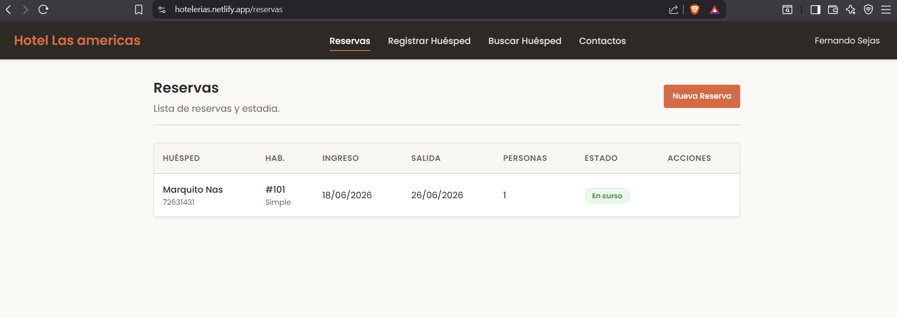
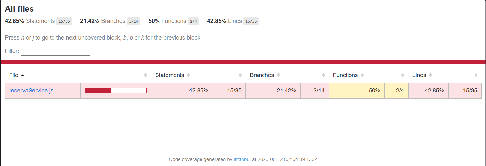
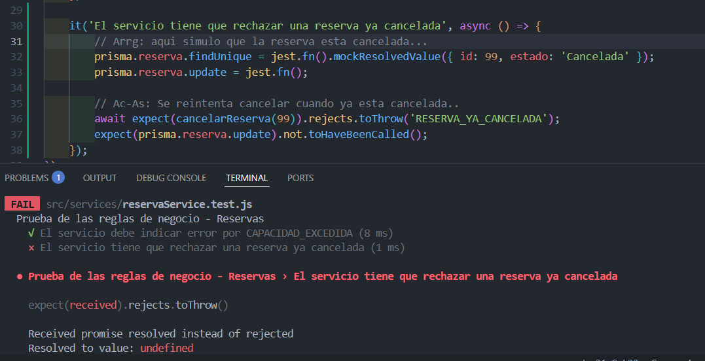
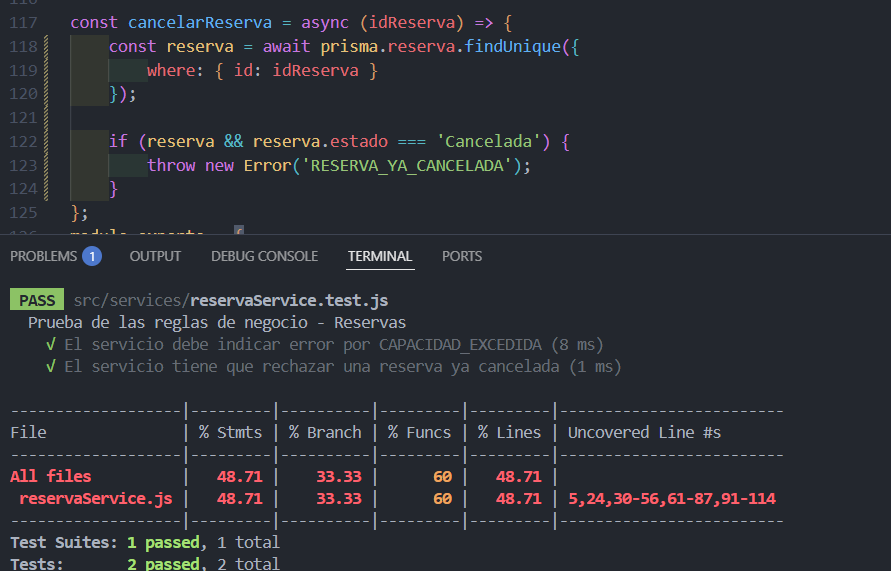
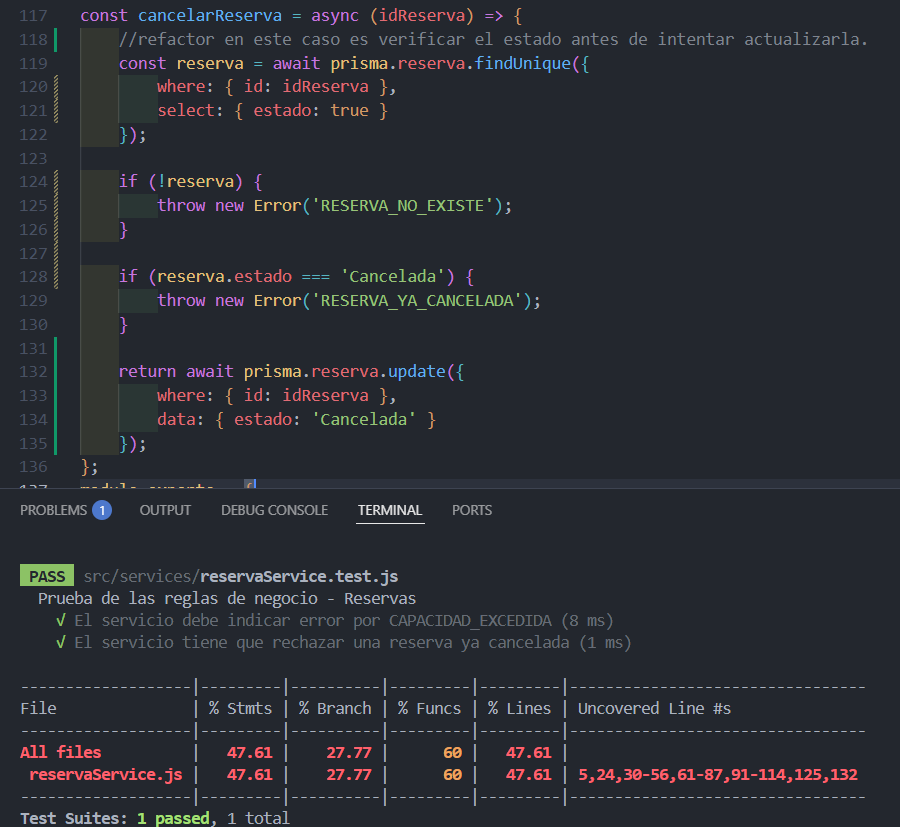

# EF — Reporte de Proyecto
**Estudiante:** [Fernando Sejas Colque]
**Proyecto:** [Hotel Pequeño]
**Repositorio:** [[URL del repositorio](https://github.com/FerSV4/Hoteleria-Taller)]
**Fecha de entrega:** [12/06/2026]

---

## Sección 1 — Deploy

**URL del proyecto:** [[URL pública](https://hotelerias.netlify.app/)]
**Swagger / API:** [[URL](https://hoteleria-taller-production.up.railway.app/api-docs/)]

> Captura del proyecto corriendo con datos reales:



---

## Sección 2 — Pruebas con TDD + cobertura

### Cobertura inicial (0%)

**Herramienta:** [Jest]

> Captura del reporte de cobertura antes de escribir pruebas nuevas:



> Cobertura de pruebas despues del ec2
---

### Ciclo TDD — Prueba 1

**HU:** [HU-05] [Gestión de Reservas]
> Como recepcionista quiero cancelar una reserva existente para que la habitacione ste libre, pero el sistema debe impedir cancelar una reserva que ya fue cancelada.

**CA elegido:** [El sistema debe rechazar la cancelacion y arrojar un error cuando se intenta cancelar una reserva en estado 'Cancelada'.]

**Commit 1 — Rojo** [`36a7106`](https://github.com/FerSV4/Hoteleria-Taller/commit/36a7106d6dc3526eae0813790b35ffda65d04004):
```
test: [HU-05] agregacion de la prueba Rechazo a reserva cancelada.
```
Test escrito (sin el código que lo pase aún):
```csharp / typescript
 it('El servicio tiene que rechazar una reserva ya cancelada', async () => {
        // Arrg: aqui simulo que la reserva esta cancelada...
        prisma.reserva.findUnique = jest.fn().mockResolvedValue({ id: 99, estado: 'Cancelada' });
        prisma.reserva.update = jest.fn();

        // Ac-As: Se reintenta cancelar cuando ya esta cancelada..
        await expect(cancelarReserva(99)).rejects.toThrow('RESERVA_YA_CANCELADA');
        expect(prisma.reserva.update).not.toHaveBeenCalled();
    });
```

> Captura del test fallando o error de compilación:



---

**Commit 2 — Verde** [`f6ad6df`](https://github.com/FerSV4/Hoteleria-Taller/commit/f6ad6df43b8c3b446d4a76dfe75f352e15975c8f):
```
feat: [HU-05] Validacion al cancelar reserva, verif.
```
Código mínimo para hacer pasar el test:
```csharp / typescript
const reserva = await prisma.reserva.findUnique({
        where: { id: idReserva }
    });

    if (reserva && reserva.estado === 'Cancelada') {
        throw new Error('RESERVA_YA_CANCELADA');
    }
```

> Captura del test pasando:



---

**Commit 3 — Refactor** [`eda38fb`](https://github.com/FerSV4/Hoteleria-Taller/commit/eda38fbc38ff151501f2433ceef8542a446a4cbc):
```
refactor: [HU-05] modificacion de funcion y se optimiza
```
Cambios aplicados:
```csharp / typescript
const cancelarReserva = async (idReserva) => {
    //refactor en este caso es verificar el estado antes de intentar actualizarla.
    const reserva = await prisma.reserva.findUnique({
        where: { id: idReserva },
        select: { estado: true }
    });

    if (!reserva) {
        throw new Error('RESERVA_NO_EXISTE');
    }

    if (reserva.estado === 'Cancelada') {
        throw new Error('RESERVA_YA_CANCELADA');
    }
    
    return await prisma.reserva.update({
        where: { id: idReserva },
        data: { estado: 'Cancelada' }
    });
```

> Captura del test aún pasando después del refactor:



---

### Ciclo TDD — Prueba 2

> Mismo formato. Incluir al menos 3 ciclos TDD completos.

---

### Ciclo TDD — Prueba 3

> Mismo formato.

---

### Cobertura final

**Cobertura alcanzada:** X%

> Captura del reporte de cobertura final:


> Si la cobertura es <50%, pegar aquí la justificación enviada al docente:

---

## Sección 3 — Code smells corregidos

Mínimo 3 nuevos (adicionales a los del EC2).

| # | Tipo | Commit | Descripción |
|---|---|---|---|
| 1 | [Tipo] | [`a1b2c3d`](https://github.com/usuario/repo/commit/a1b2c3d) | [Antes: X → Después: Y] |
| 2 | [Tipo] | [`b2c3d4e`](https://github.com/usuario/repo/commit/b2c3d4e) | [Antes: X → Después: Y] |
| 3 | [Tipo] | [`c3d4e5f`](https://github.com/usuario/repo/commit/c3d4e5f) | [Antes: X → Después: Y] |

### Detalle — Smell 1: [Tipo]

**Código antes:**
```csharp / typescript
// código con el smell
```

**Código después:**
```csharp / typescript
// código corregido
```

---

### Detalle — Smell 2: [Tipo]

> Mismo formato.

---

### Detalle — Smell 3: [Tipo]

> Mismo formato.

---

## Sección 4 — Trazabilidad HU → CA → test

| # | Historia de Usuario | Criterio de Aceptación | Prueba que valida ese CA | Commit |
|---|---|---|---|---|
| 1 | [HU título] | [Dado/Cuando/Entonces] | [NombrePrueba_Escenario_Resultado] | [`a1b2c3d`](https://github.com/usuario/repo/commit/a1b2c3d) |
| 2 | [HU título] | [Dado/Cuando/Entonces] | [NombrePrueba_Escenario_Resultado] | [`b2c3d4e`](https://github.com/usuario/repo/commit/b2c3d4e) |
| 3 | [HU título] | [Dado/Cuando/Entonces] | [NombrePrueba_Escenario_Resultado] | [`c3d4e5f`](https://github.com/usuario/repo/commit/c3d4e5f) |

### Cadena 1 — [Nombre HU]

**Historia de Usuario:**
> Como [rol] quiero [acción] para [beneficio]

**Criterio de Aceptación elegido:**
> Dado [contexto] / Cuando [acción] / Entonces [resultado esperado]

**Prueba que valida este CA:**
```csharp / typescript
[Fact / test]
public void Metodo_Escenario_ResultadoEsperado()
{
    // Arrange — setup del contexto del CA
    // Act — ejecutar la acción del CA
    // Assert — verificar el resultado del CA
}
```

---

### Cadena 2 — [Nombre HU]

> Mismo formato.

---

### Cadena 3 — [Nombre HU]

> Mismo formato.
